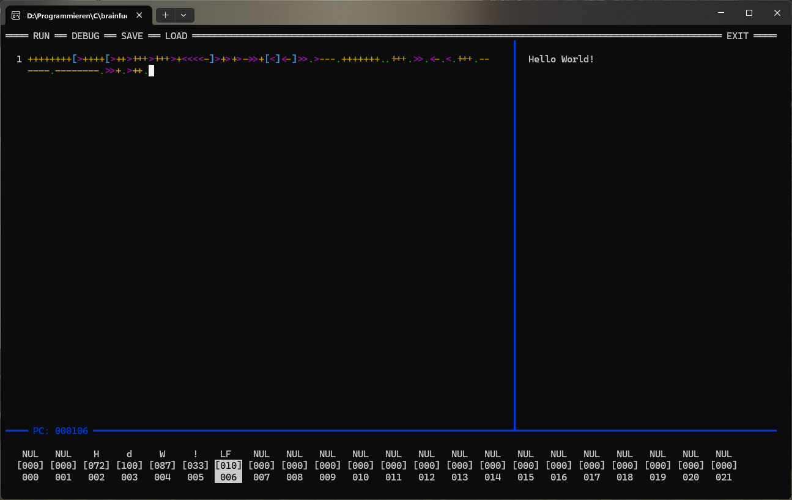

# Brainfuck IDE

A TUI-based IDE for writing, running, and debugging **brainfuck** programs, built with PDCurses.
(i apologize for the insanely bad and messy code)

---

## Features

- Syntax-highlighted editor
- Built-in interpreter
- Memory tape visualizer
- Program output panel

---

## Dependencies

- [PDCurses](https://github.com/wmcbrine/PDCurses) (MIT license)

---

## Supported Platforms
| OS      | Supported? |
|---------|------------|
| Windows | ✅ Yes      |
| Linux   | ❌ No       |
| macOS   | ❌ No       |

> If you are willing to add support for any of the unsupported platforms, I'd be happy to merge a PR! :) 

---

## How to try it yourself

The IDE is self-contained. It does not need any external libraries or whatsoever. To run it, simply open the executable file.

---

## Brainfuck Primer

Brainfuck operates on an array of memory cells (the "tape"), each initialized to zero, with a pointer starting at the leftmost cell. There are only 8 commands:

| Command | Effect                                                         |
|---------|----------------------------------------------------------------|
| `>`     | Move the pointer right                                         |
| `<`     | Move the pointer left                                          |
| `+`     | Increment the current cell                                     |
| `-`     | Decrement the current cell                                     |
| `.`     | Output the current cell as an ASCII character                  |
| `,`     | Read one byte of input into the current cell                   |
| `[`     | If the current cell is zero, jump forward to the matching `]`  |
| `]`     | If the current cell is non-zero, jump back to the matching `[` |

Everything else in the source is treated as a comment.

### Hello, World!

```brainfuck
++++++++[>++++[>++>+++>+++>+<<<<-]>+>+>->>+[<]<-]>>.>---.+++++++..+++.>>.<-.<.+++.------.--------.>>+.>++.
```

For a full language reference, see the [Wikipedia article on Brainfuck](https://wikipedia.org/wiki/Brainfuck).

---

This project is licensed under the **GNU General Public License v3.0** (`GPL-3.0-only`). See the [LICENSE](LICENSE) file for details.

---


